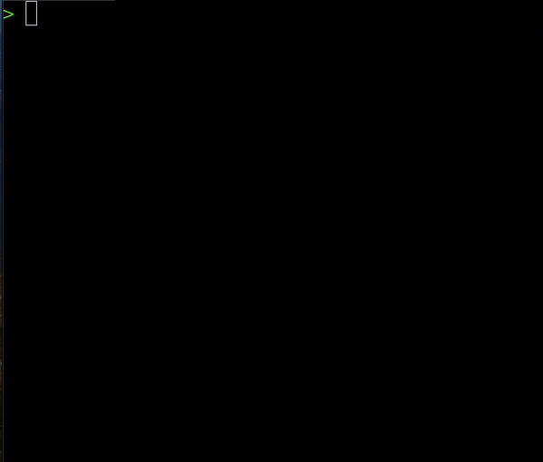

# Go Gentest
> Go Generate Test. It generates `_test.go` files for each `.go` file in the current directory.

# Content
- [Introduction](#introduction)
- [Prerequisites](#prerequisites)
- [Flags](#flags)
- [List of flags](#list-of-flags)
- [Further Improvement](#further-improvement)

# Introduction
Why this project exist? To provide the way to generate `_test.go` files to brogrammers that got tired of writing the same thing again and again.

# Prerequisites
* [Go](https://go.dev/) >= 1.21.3

# Installation
## Using bash
```bs
cd &&
git clone git@github.com:star-light-nova/go-gentest.git &&
cd gentest &&
go build &&
go install
```


# Flags
The flags are needed to get control over the generator. For example, if you don't want to create tons of files, you can use `--dry-run` flag, that will output to your terminal, instead of creating `_test.go` files.

## List of flags
1. `dry-run` - Outputs everything in the terminal instead of creating `_test.go` files.
 
	```bs
	gentest start --dry-run
	```

 2. `test-folder` - Generates `_test.go` files in the specified folder in accordance of the original files' path.
 
	```bs
	gentest start --test-folder=test	
	```

3. `test-only` - Generates `_test.go` file, only for one specified file

	```bs
	gentest start --test-only=path/to/file.go
	```
# Further improvement
Nothing is perfect, so try to contribute something in here if you have a free time.
[Link to the project](https://github.com/users/star-light-nova/projects/4/)
